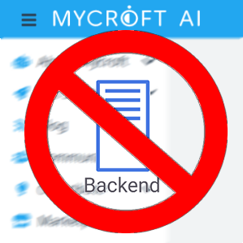

# Mock Backend Skill



Disable mycroft from phoning home.mycroft.ai


## About

Just install the skill and backend will be disabled

PRIVACY NOTE: you need to setup your own STT, by default it will use google

[kaldi](https://github.com/HelloChatterbox/speech2text/blob/dev/speech2text/engines/kaldi.py) and [deepspeech](https://github.com/HelloChatterbox/speech2text/blob/dev/speech2text/engines/ds.py) are supported

This is beta, some skills WILL break, you will lose:

- web skill settings interface
- web device configuration interface
- wolfram alpha proxy 
- open weather map proxy 
- geolocation api
- send emails functionality (unless configured in mock_backend.conf)


## Configuration

configure backend by editing/creating ```~/.mycroft/mock_backend/mock_backend.conf```

restarting mycroft is needed after editing this file

see [OpenJarbas/mock-backend](https://github.com/OpenJarbas/mock-backend) for details

```json
{
    "stt": {
        "module": "google"
    },
    "backend_port": 6712,
   
    "mail_user": "xxx@gmail.com",
    "mail_password": "xxx",
    
    "default_location": {
        "city": {
            "code": "Lawrence",
            "name": "Lawrence",
            "state": {
                "code": "KS",
                "name": "Kansas",
                "country": {
                    "code": "US",
                    "name": "United States"
                }
            }
        },
        "coordinate": {
            "latitude": 38.971669,
            "longitude": -95.23525
        },
        "timezone": {
            "code": "America/Chicago",
            "name": "Central Standard Time",
            "dstOffset": 3600000,
            "offset": -21600000
        }
    },
    "geolocate": false,
    "override_location": false,
    "email": "xxx@gmail.com"
}
```

## Examples

* "restore mycroft backend"
* "disable mycroft backend"
* "what backend are you using"

## Credits
JarbasAl

## Category
**configuration**

## Tags
#configuration
